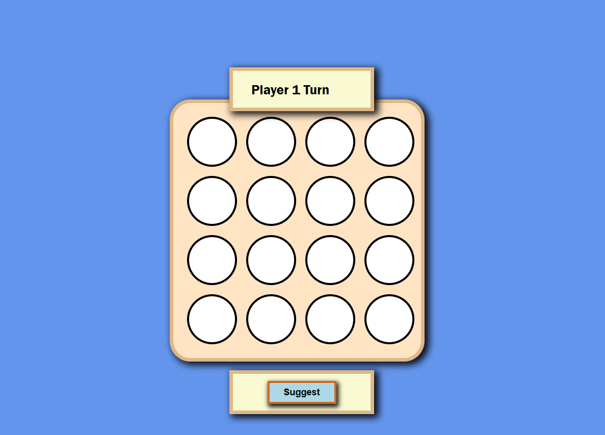

# 🎮 React Tic-Tac-Toe Game

**Interactive 4x4 Tic-Tac-Toe with AI opponent and responsive design**

---

## 📋 Project Summary

This is a fully functional, interactive Tic-Tac-Toe game built with React, featuring an expanded 4x4 board instead of the traditional 3x3. The project demonstrates modern React development practices including functional components, hooks-based state management, and responsive UI design. Players can challenge themselves against the computer AI, which provides move suggestions using smart game logic.

---

## 🎯 Project Overview

**Gameplay Experience:**
- Play Tic-Tac-Toe on an expanded 4x4 board with dynamic win conditions
- Two-player mode (Player vs. AI)
- Real-time game state feedback with current player indication
- Computer AI provides intelligent move suggestions
- Instant win/draw detection with visual feedback
- One-click game reset to start fresh rounds

**User Experience:**
- Clean, intuitive interface with clear game board layout
- Visual distinction between player moves (X and O)
- Header displays current player and game status
- Footer controls for restart and AI suggestions
- Fully responsive design for desktop and tablet devices

---

## ✨ Key Features

- ✅ **4x4 Expandable Board** – Extended gameplay with more strategic depth
- ✅ **Win Detection** – Detects 4-in-a-row across rows, columns, and diagonals
- ✅ **Draw Detection** – Recognizes board-full scenarios
- ✅ **AI Suggestions** – Computer recommends optimal moves
- ✅ **Game State Management** – Tracks playing, won, and draw states
- ✅ **Reset Functionality** – Start new games without page reload
- ✅ **Responsive Design** – Adapts to multiple screen sizes
- ✅ **Component Architecture** – Modular, maintainable React structure

---

## 🖼️ Preview



**Live Demo:** [https://abrahamsanchezdev.github.io/react-tutorials/](https://abrahamsanchezdev.github.io/react-tutorials/)

---

## 📁 Project Structure

```
src/
├── Constants.js          # Game state constants (PLAYER1, PLAYER2, GAME_STATE_*)
├── helper.js             # Game logic utilities (win/draw detection, AI moves)
├── Game.css              # Styling for game board and components
├── index.js              # React app entry point
├── Components/
│   ├── App.js            # Root component container
│   ├── GameBoard.js      # Main game logic and state management
│   ├── GameCircle.js     # Individual board cell component
│   ├── Header.js         # Displays current player and game status
│   └── Footer.js         # Reset and AI suggestion controls
```

---

## 🏗️ Architecture Highlights

**Design Patterns:**
- **Component Composition** – Nested, reusable components (GameBoard, GameCircle, Header, Footer)
- **State Lifting** – Game state centralized in GameBoard parent component
- **Functional Components + Hooks** – Uses React.useState and useEffect for lifecycle management
- **Separation of Concerns** – Game logic isolated in helper.js, UI components in Components/

**System Responsibilities:**
- **GameBoard**: Orchestrates game state, win/draw logic, and turn management
- **GameCircle**: Clickable board cell with player indicator
- **Helper**: Pure functions for win detection (4-in-a-row validation) and AI move generation
- **Constants**: Centralized game configuration and state enumeration

---

## 🛠️ Technology Stack

- **React 18** – Modern UI library with hooks support
- **JavaScript (ES6+)** – Native game logic and utility functions
- **CSS3** – Responsive styling with flexbox layout
- **Create React App** – Zero-config build setup and development environment
- **GitHub Pages** – Free hosting for static builds

---

## 💡 Code Quality & Engineering Practices

**Architecture & Maintainability:**
- Clean component hierarchy with single responsibility principle
- Declarative UI that reflects application state
- Pure utility functions for game logic with no side effects
- Centralized constants prevent magic numbers throughout codebase
- Modular CSS structure tied to component organization

**Professional Standards:**
- ESLint configuration ensures consistent code style
- Testing setup included via Create React App (Jest + React Testing Library)
- Production build optimized with minification and hashing
- Environment-agnostic logic allows easy testing and refactoring

---

## 🚀 How to Build & Run Locally

**Prerequisites:**
- Node.js 14+ and npm

**Installation & Development:**

```bash
# Install dependencies
npm install

# Start development server
npm start
```

The app opens at `http://localhost:3000` with hot reload enabled.

**Building for Production:**

```bash
# Create optimized production build
npm run build

# Deploy to GitHub Pages
npm run deploy
```

---

## 🎓 Learning Outcomes

This project demonstrates:
- **React Hooks Mastery** – useState and useEffect for state and side effects
- **Game State Management** – Tracking complex game conditions without Redux
- **Algorithm Implementation** – Win detection logic for extended boards
- **Component Design** – Building reusable, composable UI components
- **Responsive Web Design** – CSS Grid/Flexbox for adaptive layouts
- **GitHub Pages Deployment** – Automated CI/CD with gh-pages package

---

## 📝 Notes

The project is deployed to GitHub Pages via the `npm run deploy` command, which automates the build and deployment process. The `predeploy` script ensures production builds are current before pushing to the gh-pages branch.

---

## 👤 Author

[Abraham Sanchez](https://github.com/abrahamsanchezdev)  
GitHub: [react-tutorials Repository](https://github.com/abrahamsanchezdev/react-tutorials)
